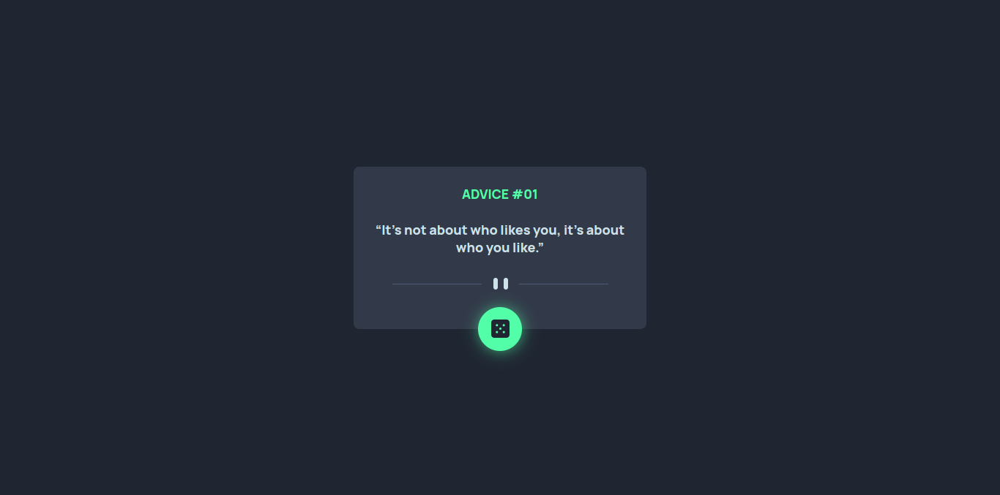

# Frontend Mentor - Advice generator app solution

This is a solution to the [Advice generator app challenge on Frontend Mentor](https://www.frontendmentor.io/challenges/advice-generator-app-QdUG-13db). Frontend Mentor challenges help you improve your coding skills by building realistic projects.

## Table of contents

- [Overview](#overview)
  - [The challenge](#the-challenge)
  - [Screenshot](#screenshot)
  - [Links](#links)
- [My process](#my-process)
  - [Built with](#built-with)
  - [What I learned](#what-i-learned)
  - [Continued development](#continued-development)
- [Author](#author)
- [Acknowledgments](#acknowledgments)

**Note: Delete this note and update the table of contents based on what sections you keep.**

## Overview

### The challenge

Users should be able to:

- View the optimal layout for the app depending on their device's screen size
- See hover states for all interactive elements on the page
- Generate a new piece of advice by clicking the dice icon

### Screenshot

### Links

- Solution URL: [https://github.com/Raymacmillan/Advice-Generator-App](https://github.com/Raymacmillan/Advice-Generator-App)
- Live Site URL: [https://raymacmillan.github.io/Advice-Generator-App/](https://raymacmillan.github.io/Advice-Generator-App/)

## My process

### Built with

- Semantic HTML5 markup
- Flexbox
- Mobile-first workflow

### What I learned

I learn't about JSAPIs which was my very first project for API's.I learnt how to use async functions,catch,await and got to aquire a brief understanding of promises.I also learnt various CSS tricks such as transform(translate) and @keyframes;

### Continued development

I want to focus mainly on understanding how Javascript executes functions as well as the code in general as i seem to have a bit of a problem understanding where exactly to place specific lines of code

## Author
- Frontend Mentor - [@Raymacmillan](https://www.frontendmentor.io/profile/Raymacmillan)
- Twitter - [@RyoGenex](https://www.twitter.com/RyoGenex)

## Acknowledgments
I would like to thank W3school for helping me understand the new shortcut method of place-content as well as @keyframes.